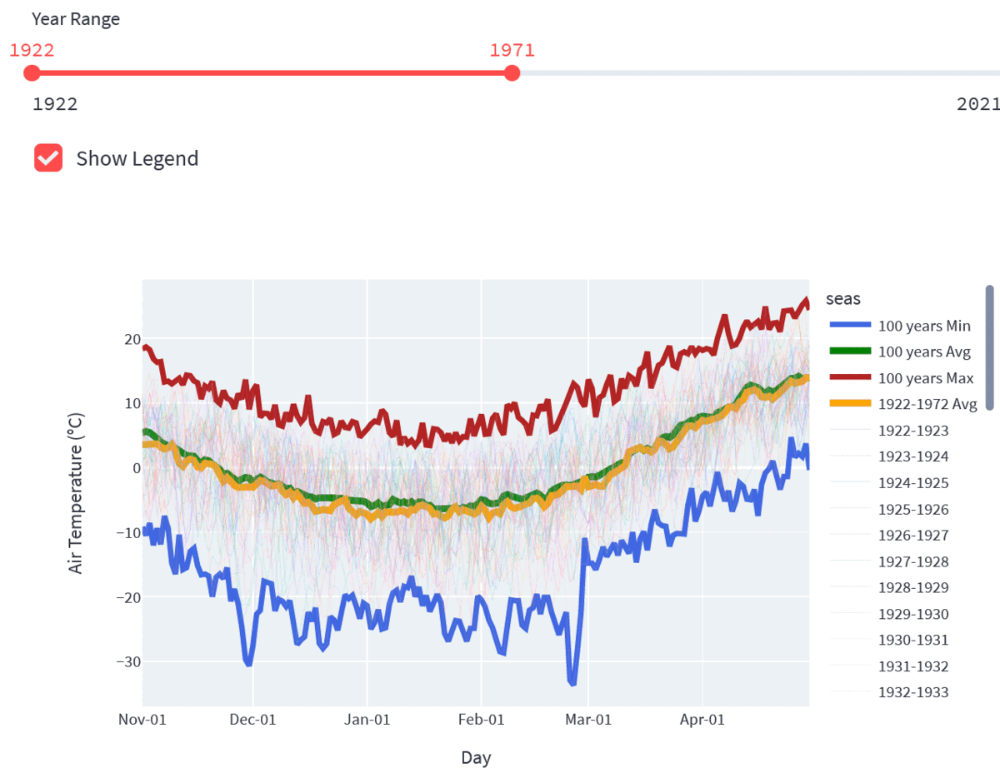
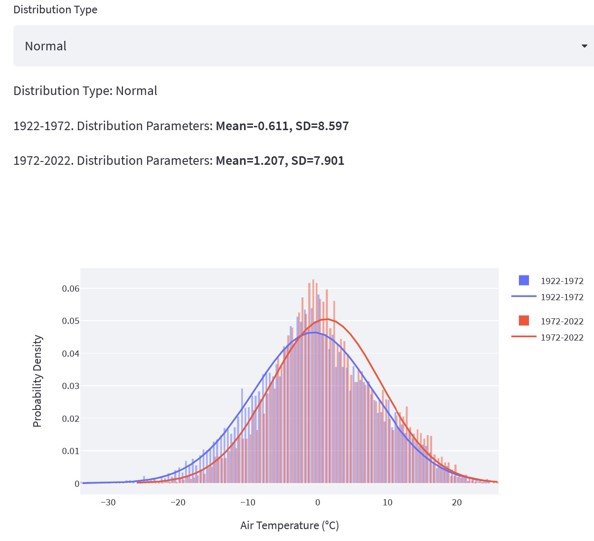
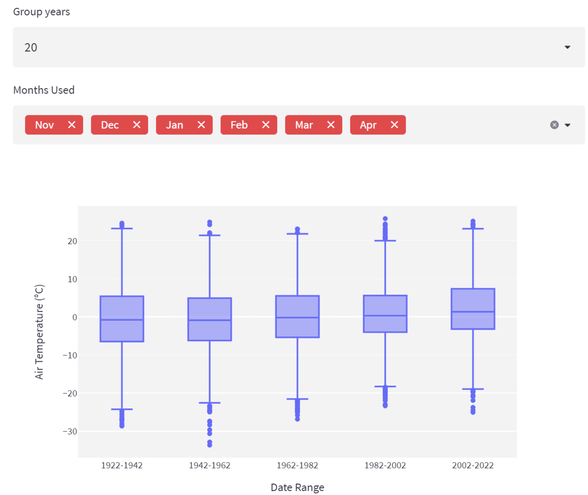

# Almaty winter climate, Streamlit Dashboard

This is a code for [Streamlit Dashboard](https://share.streamlit.io/yevkad/alaclim/main/app.py)
of winter climate analysis in the city of Almaty, Kazakhstan, based on
100 years air temperature (AT) observations from 01 Novermber to 30 April.
Dashboard includes interactive time series, distributions and other types of graphical comparisons. Streamlit controllers allow to select comparison period.

For winter severity index I used Freezing Degree Days (FDD) and ran Mann-Kendall test to assess the statistical significance of the winter severity trend.

Data Courtesy:
1922-2005 [NOAA Climate Data](https://www.ncdc.noaa.gov/cdo-web/),
2005-2022 [RP5](https://rp5.ru/)
## Plot examples
Here some plots that are available in the Dashboard.

Comparison of 100 aggregated AT with selected periods mean at a particular day:

Comparison of histograms and fitted PDFs from two fixed 50 years periods: 1922-1972 and 1972-2022:

Box plot of distribution of air temperature comparison grouped every 20 years.

